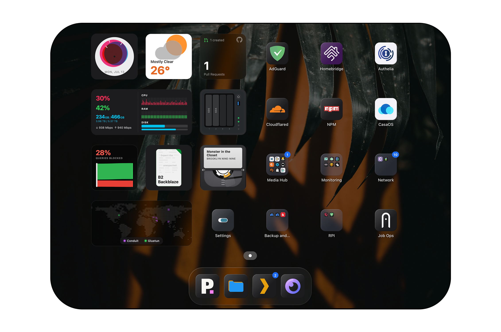

<h1 align="center">Stackyard</h1>

<p align="center"><b>A self-hosted homelab dashboard you actually want to look at.</b></p>

<p align="center">
  <a href="LICENSE"></a>
  <a href="https://github.com/SandObserver/stackyard/pkgs/container/stackyard"></a>
</p>

<p align="center"></p>

Most dashboards are a wall full of numbers and charts. Stackyard is the opposite: a calm, launcher-style grid of app tiles, folders, and a small number of
*genuinely useful* widgets, running in a single container with no external services or dependencies. It is built to be glanced at a hundred times a day without ever feeling cluttered.

## Contents

- [Why Stackyard](#why-stackyard)
- [Features](#features)
- [Getting started](#getting-started)
- [Building from source](#building-from-source)
- [Configuring](#configuring)
- [Icons](#icons)
- [Widgets](#widgets)
- [Live activity badges](#live-activity-badges)
- [Security](#security)
- [Contributing](#contributing)
- [Changelog](#changelog)
- [License](#license)

## Why Stackyard

**Design**

- **Attention goes where it's needed, not everywhere at once.** A calm grid, no charts or counters. Health badges only appear when something's wrong; a working system looks calm, not busy.
- **A glance should tell you more than a number would.** Widgets are small visuals, not readouts.

**How it works**

- **Anything can be a badge.** If a service has an API, point Stackyard at it, pick a value from the response, and show it as a [live activity badges](#live-activity-badges). No custom widget, no code.
- **Configured by clicking, not by editing files.** Everything is set up in the web UI.
- **No dependencies.** Review it once and stop worrying about the supply chain.

## Features

- Launcher-style grid of app links, folders, and widgets, with a mobile layout.
- A small but growing set of visual widgets (see [Widgets](#widgets)).
- Live activity badges from any API endpoint, configured in the UI.
- Health badges that appear only on problems.
- Full configuration from the admin UI, with config import and export.
- Available in English, Persian, Chinese, Spanish, German, and French.

## Getting started

You need Docker.

**Using Docker Compose** (`docker-compose.yml`):

```yaml
services:
  stackyard:
    image: ghcr.io/sandobserver/stackyard:latest
    container_name: stackyard
    restart: unless-stopped
    ports:
      - "8700:80"
    volumes:
      - ./data:/data
      - ./icons:/icons
```

```sh
docker compose up -d
```

**Or with `docker run`:**

```sh
docker run -d \
  --name stackyard \
  --restart unless-stopped \
  -p 8700:80 \
  -v ./data:/data \
  -v ./icons:/icons \
  ghcr.io/sandobserver/stackyard:latest
```

Then open `http://localhost:8700` and set things up from the admin app on the dashboard (or go to `/admin`). Your config and uploaded icons persist in `./data` and
`./icons`.

The [`docker-compose.yml`](docker-compose.yml) in the repo is the recommended version: it adds resource limits, dropped capabilities, and commented options for a reverse proxy, host access (for stats and reaching services by host IP), and Docker health checks.

## Building from source

```sh
git clone https://github.com/SandObserver/stackyard.git
cd stackyard
docker build -t stackyard:local .
```

Then run `stackyard:local` the same way as above (with `docker run`, or by setting `image: stackyard:local` in the compose file). CI builds and publishes the multi-arch image on tagged releases.

For working on the code without Docker, see [CONTRIBUTING.md](CONTRIBUTING.md).

## Configuring

Everything is configured in the admin UI (`/admin`), split into a few sections:

- **General**: title, description, and your server's **Host IP** (used to allow your own server in badge URLs and SSRF checks). Also **Monitoring** (logging level, Docker container health checks, and the socket URL used to reach Docker), optional **password protection**, and config **import / export**.
- **Appearance**: wallpaper and the overall look.
- **Dashboard**: add and arrange your apps, folders, and widgets, and configure each one (including live activity badges).
- **About**: version and links.

## Icons

App icons resolve automatically by name from the community [dashboard-icons](https://github.com/homarr-labs/dashboard-icons) set (served over a CDN), so most services get a good icon with no effort. You can also upload your own; custom icons are stored in `./icons`.

## Widgets

Each widget is small and visual by design. Current widgets and the services they integrate with:

- **Clock**
- **Now Playing** (a VHS tape that turns and fills as media plays): Plex, Jellyfin, Emby, Navidrome
- **Weather**: Open-Meteo (no API key required)
- **DNS** (a Sankey view of query filtering): AdGuard, Pi-hole, Technitium, NextDNS
- **GitHub**: contribution graph and open pull requests
- **Books**: Audiobookshelf, Komga, Kavita
- **System stats** (CPU, memory, disk, network): SpeedTest Tracker, MySpeed
- **Disk health**: TrueNAS, Scrutiny
- **Backup**: Duplicati, Kopia
- **Connections**: Gluetun, Psiphon Conduit, Netbird, Plausible, Umami

Adding a widget is meant to be easy and self-contained: a folder plus one registry entry, with no changes to the rest of the app. See [docs/widgets.md](docs/widgets.md). Shared helpers for fetching, drawing, and graceful failure live in `ui/js/widget-toolbox.js`.

## Live activity badges

This is the part that replaces a pile of one-off widgets. Instead of writing a widget to surface one number from a service, you point Stackyard at any API endpoint, and it shows you the values in the response. Pick the one you care about (say, pending requests in a media server, or items in a queue), and it becomes a small badge on that tile. Any service with an API becomes a first-class part of your dashboard, without code.

## Security

Stackyard is built to be careful with your homelab: it never returns stored secrets to the browser, guards outbound widget requests against SSRF, pins resolved IPs, and bounds every upstream call so one slow service cannot hang the dashboard. Some features trade safety for convenience and are opt-in with warnings. Read [docs/security.md](docs/security.md) before exposing Stackyard beyond your LAN.

## Contributing

Contributions are welcome, within the constraints that keep Stackyard small and auditable (one container, no backend dependencies, vanilla frontend). See [CONTRIBUTING.md](CONTRIBUTING.md), and [docs/frontend.md](docs/frontend.md) for how the frontend fits together.

## Changelog

Notable changes are listed in [CHANGELOG.md](CHANGELOG.md); per-release notes are on the [GitHub Releases](https://github.com/SandObserver/stackyard/releases) page.

## License

Licensed under the [Apache License 2.0](LICENSE). You are free to use, modify, fork, and build on Stackyard, including commercially. In return you must keep the existing copyright and attribution notices, and the license does not grant rights to the **Stackyard** name or logo: forks are welcome but must use their own name and not present themselves as the original project. See [NOTICE](NOTICE).
